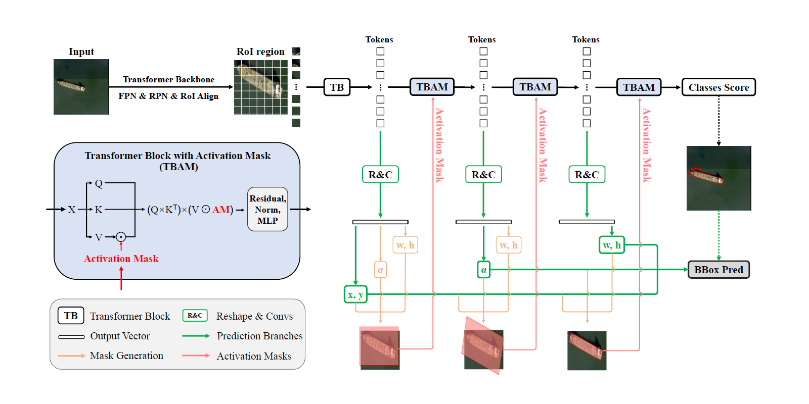

# Spatial Transform Decoupling 

## 項目介紹

Spatial Transform Decoupling（STD）是一種基於視覺Transformer（ViT）的旋轉目標檢測方法。該方法通過空間變換解耦思想，使用單獨的網絡分支來預測邊界框的位置、大小和角度，有效提升了旋轉目標檢測的性能。

本項目基於MMRotate框架實現了STD算法，實現了先進的旋轉目標檢測功能，在DOTA-v1.0和HRSC2016等基準數據集上取得了最先進的性能。



## 主要特點

- **先進架構**：使用Vision Transformers實現高精度旋轉目標檢測
- **創新技術**：採用空間變換解耦技術，提高對旋轉物體的檢測能力
- **多數據集支援**：支援DOTA、HRSC等多種數據集格式
- **完整工具鏈**：提供訓練、評估和可視化一體化工具
- **高性能**：在DOTA-v1.0和HRSC2016上達到SOTA性能

## 環境安裝

### 依賴項

- Python 3.7+
- PyTorch 1.7.0+
- MMCV 1.6.0+
- MMDetection 2.25.1+
- MMRotate 0.3.4+

### 安裝步驟

```bash
# 創建conda環境
conda create -n rotation python=3.7 -y
conda activate rotation

# 安裝PyTorch
conda install pytorch=1.8.0 torchvision torchaudio cudatoolkit=10.2 -c pytorch

# 安裝基礎依賴
pip install openmim
mim install mmcv-full==1.6.1
mim install mmdet==2.25.1

# 安裝MMRotate
git clone https://github.com/open-mmlab/mmrotate.git
cd mmrotate
pip install -r requirements/build.txt
pip install -v -e .
cd ..

# 安裝其他依賴
pip install timm apex

# 複製項目文件
git clone https://github.com/yuhongtian17/Spatial-Transform-Decoupling.git
cp -r Spatial-Transform-Decoupling/mmrotate-main/* mmrotate/
```

## 數據準備

### 數據結構

按照以下結構組織您的數據集：

```
mmrotatemain/data/dxc/
  ├── train/
  │   ├── images/   # 訓練圖像
  │   └── annfiles/ # 訓練標註文件
  ├── val/
  │   ├── images/   # 驗證圖像
  │   └── annfiles/ # 驗證標註文件
  └── test/
      ├── images/   # 測試圖像
      └── annfiles/ # 測試標註文件
```

### 數據放置步驟

1. 將訓練圖像放入`mmrotatemain/data/dxc/train/images/`目錄
2. 將對應的標註文件放入`mmrotatemain/data/dxc/train/annfiles/`目錄
3. 類似地，將驗證和測試數據放入對應目錄

## 模型訓練

### 訓練流程概述

本項目的訓練流程基於MMRotate框架，主要由以下步驟組成：

1. 解析訓練參數和配置文件
2. 初始化分佈式訓練環境（如需）
3. 創建工作目錄和日誌
4. 構建模型、數據集和優化器
5. 執行訓練循環並定期保存檢查點
6. 驗證模型性能（可選）

### 配置文件詳解

訓練前需要準備好配置文件，默認位於`mmrotatemain/configs/train_config.py`，主要配置項包括：

#### 1. 數據集配置

```python
dataset_type = 'DOTADataset'
data_root = './mmrotatemain/data/dxc/'
data = dict(
    samples_per_gpu=1,           # 每個GPU的批次大小
    workers_per_gpu=2,           # 每個GPU的數據加載工作進程數
    train=dict(
        type='DOTADataset',
        ann_file='./mmrotatemain/data/dxc/train/annfiles/',
        img_prefix='./mmrotatemain/data/dxc/train/images/',
        pipeline=train_pipeline,
        version='le90'),         # 角度表示版本，le90表示[-90°,0°)
    # 驗證和測試集配置...
)
```

#### 2. 模型配置

```python
model = dict(
    type='RotatedimTED',         # 模型類型
    proposals_dim=6,             # 提議框維度
    backbone=dict(               # 主幹網絡配置
        type='HiViT',
        img_size=224,
        patch_size=16,
        embed_dim=512,
        depths=[2, 2, 20],
        # 其他骨幹網絡參數...
    ),
    neck=dict(                   # 特徵融合網絡
        type='FPN',
        in_channels=[128, 256, 512, 512],
        out_channels=256,
        num_outs=5),
    rpn_head=dict(               # 區域提議網絡頭
        type='OrientedRPNHead',
        # 提議網絡參數...
    ),
    roi_head=dict(               # 區域興趣頭
        type='OrientedStandardRoIHeadimTED',
        bbox_roi_extractor=[...],
        bbox_head=dict(          # 邊界框預測頭
            type='RotatedMAEBBoxHeadSTDC',
            # 邊界框頭參數...
            dc_mode_str_list=['', '', '', 'XY', '', 'A', '', 'WH'],  # 解耦模式
            am_mode_str_list=['', '', 'V', 'V', 'V', 'V', 'V', 'V'],  # 激活掩碼模式
            rois_mode='rbbox'
        )
    ),
    # 訓練和測試配置...
)
```

#### 3. 優化器配置

```python
optimizer = dict(
    type='AdamW',
    lr=0.0001,                   # 學習率
    betas=(0.9, 0.999),          # Adam優化器參數
    weight_decay=0.05,           # 權重衰減
    constructor='HiViTLayerDecayOptimizerConstructor',
    paramwise_cfg=dict(num_layers=20, layer_decay_rate=0.9)  # 層衰減率配置
)
```

### 訓練方式

#### 方式一：使用啟動腳本（推薦）

```bash
cd Spatial-Transform-Decoupling-main
python mmrotatemain/start_train.py --work-dir=./work_dirs/my_training
```

參數說明：
- `--config`: 配置文件路徑（默認`./configs/train_config.py`）
- `--work-dir`: 工作目錄，用於保存模型和日誌
- `--gpus`: 使用的GPU數量
- `--resume-from`: 從檢查點恢復訓練

#### 方式二：使用MMRotate原生訓練工具

```bash
cd Spatial-Transform-Decoupling-main
python mmrotatemain/tools/train.py mmrotatemain/configs/train_config.py --work-dir=./work_dirs/my_training
```

#### 分佈式訓練（多GPU）

```bash
CUDA_VISIBLE_DEVICES=0,1,2,3 python -m torch.distributed.launch --nproc_per_node=4 mmrotatemain/tools/train.py mmrotatemain/configs/train_config.py --launcher pytorch
```

### 訓練監控

訓練日誌將保存在工作目錄中，包含：
- 環境信息（Python版本、CUDA版本等）
- 配置文件內容
- 迭代損失值（分類損失、邊界框回歸損失等）
- 學習率變化
- 驗證結果（如啟用）

## 模型評估

### 性能評估

```bash
cd Spatial-Transform-Decoupling-main
python evaluation/evaluate_model.py
```

評估腳本流程：
1. 加載配置文件和模型權重
2. 構建測試數據集和數據加載器
3. 在測試集上運行推理
4. 計算評估指標（mAP、精確率、召回率等）

### 結果可視化

#### 批量可視化測試集

```bash
python evaluation/visualize_results.py
```

結果保存在`./visualization_results`目錄，顯示真實標註（綠色框）和模型預測結果（紅色框）。

#### 單張圖像評估

```bash
python evaluation/visualize_single_image.py --img /path/to/your/image.jpg --out output.jpg
```

參數說明：
- `--img`: 輸入圖像路徑
- `--out`: 輸出圖像路徑（默認`output_result.jpg`）
- `--score-thr`: 檢測結果分數閾值（默認0.3）

## STD算法核心概念

Spatial Transform Decoupling（STD）是一種針對旋轉目標檢測的創新方法：

1. **空間變換解耦**：
   - 將邊界框參數（位置、尺寸、角度）分別由不同網絡分支預測
   - 有效解決旋轉目標檢測中的角度敏感問題

2. **級聯激活掩碼（CAMs）**：
   - 基於回歸參數計算激活掩碼
   - 逐步增強感興趣區域（RoIs）的特徵
   - 與自注意力機制互補提升特徵表示能力

3. **Vision Transformer架構**：
   - 利用ViT強大的特徵提取能力
   - 針對旋轉目標檢測任務專門優化

## 預訓練模型

項目提供以下預訓練模型：

| 模型名稱 | 下載鏈接 | 提取碼 |
|---------|----------|-------|
| Imagenet MAE預訓練ViT-S | [百度網盤](https://pan.baidu.com/s/19nw-Ry2pGoeHZ0lQ-XehQg) | STDC |
| Imagenet MAE預訓練ViT-B | [官方鏈接](https://dl.fbaipublicfiles.com/mae/pretrain/mae_pretrain_vit_base_full.pth) | - |
| Imagenet MAE預訓練HiViT-B | [百度網盤](https://pan.baidu.com/s/19nw-Ry2pGoeHZ0lQ-XehQg) | STDC |

## 常見問題

### 路徑問題
```markdown
**問題**：數據加載失敗，提示路徑錯誤  
**解決**：
1. 檢查配置文件中數據路徑是否正確
2. Windows系統需將路徑分隔符替換為`\\`
3. 確保數據集結構符合要求
```

### 內存不足
```markdown
**問題**：訓練時出現CUDA內存不足錯誤  
**解決**：
1. 減小`configs/train_config.py`中的`samples_per_gpu`值
2. 使用梯度累積技術
3. 降低圖像分辨率
```

### 模型權重加載
```markdown
**問題**：權重加載失敗  
**解決**：
1. 檢查模型結構是否與權重文件匹配
2. 確保預訓練模型下載完整
3. 使用`strict=False`參數加載部分權重
```

## 性能基準

| 數據集 | 骨幹網絡 | mAP | 下載 |
|-------|---------|-----|------|
| DOTA-v1.0 | HiViT-S | 78.23 | [模型](https://example.com/dota_hivit_s) |
| DOTA-v1.0 | ViT-B | 76.54 | [模型](https://example.com/dota_vit_b) |
| HRSC2016 | HiViT-S | 89.67 | [模型](https://example.com/hrsc_hivit_s) |

## 致謝

本項目基於以下開源工作：

- [imTED](https://github.com/LiewFeng/imTED)：旋轉目標檢測框架
- [HiViT](https://github.com/zhangxiaosong18/hivit)：高效視覺Transformer
- [MMRotate](https://github.com/open-mmlab/mmrotate)：旋轉目標檢測工具包

特別感謝[Xue Yang](https://yangxue0827.github.io/)在旋轉目標檢測領域的開創性工作。